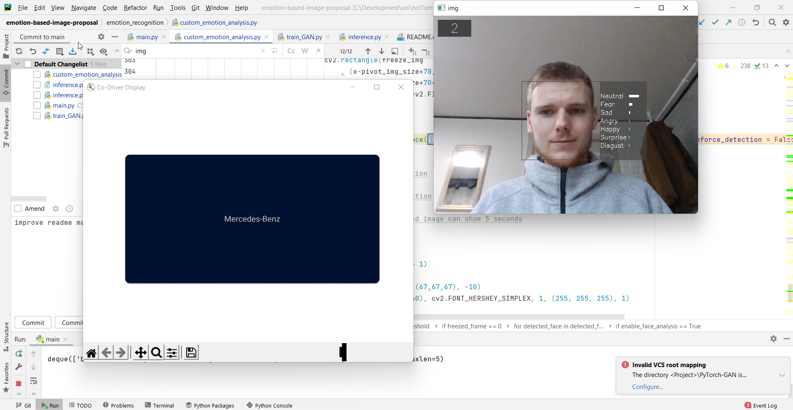

# Emotion-Based Image-Proposal
University project @Hanyang University

## About
This project is about a smart image proposal for the co-driver display in a car. 
If an emotion recognition systems recognizes emotions like anger, sadness etc.
but also an extreme happiness or a high tiredness
(i. e. a negative valence of a driver or a
too high or too low arousal), the co-driver display will show images trying
to create a positive valence and a suitable arousal of the driver
in order to avoid stress, drowsiness, distractions and eventually car accidents.

<!--
Valence: pleasant…unpleasant / happy…unhappy
Arousal: excited…calm
Dominance: dependent…independent / controlled…in control 
-->

The original plan was to use a emotion recognition software that is able to detect 
values for valence and arousal or pleasure, arousal and dominance (PAD). In this way,
the Self-Assessment Manikin (SAM) could be used. 
However, one of the best software on GitHub is 
[deepface](https://github.com/serengil/deepface) 
which is based on seven emotions.


Default Mode          |  Negative Emotion Mode
:-------------------------:|:-------------------------:
  |  


**todo add second image with GAN**


## How to use
1. Create a virtual environment (venv) in Python (e.g. via PyCharm) for this project.
1. Install  [deepface](https://github.com/serengil/deepface), 
   [PyTorch-GAN](https://github.com/eriklindernoren/PyTorch-GAN) 
   and other dependencies
   simply by typing
```$ pip install -r requirements.txt```.
1. Download the dataset [Landscape Pictures](https://www.kaggle.com/datasets/arnaud58/landscape-pictures?resource=download)
   unzip it and put the raw files into the folder ```GAN/dataset/landscape_complete/landscape_class```
1. Training
    1. Set ```load_existing_model = False``` for the first time. 
       For further training, the value can be set to ```True``` 
       to train an existing model.
    1. If necessary, adapt the parameters in the file **`model_architecture.py`** in the ```GAN``` folder.
       There, it's possible to both adapt values concerning the model and the training.
       Let's give an example: The dataset includes 4,319 images. 
       If we run this software over 100 epochs and 
       if we choose a batch-size of 32, it means that 
       each of the 100 epochs has 4,319/32 = 134,97 (rounded 135) batches since
       all images are fully regarded in each epoch.
    1. Run **`train_GAN.py`** in the ```GAN``` folder to train the GAN on the dataset.
1. Testing/Inference
    1. Make sure that the camera of the laptop is activated.
    1. Run **`main.py`** to start the emotion-based image proposal sytem. 
        This will run a script for
       the emotion recognition **`custom_emotion_analysis.py`**. If the emotion is
       not suitable (as described above), the trained GAN-model will generate
       an image by executing the script **`inference.py`**. This will replace the default UI image.
       

## Outlook

Instead of a facial emotion detection algorithm,
also other dimensions could have been used. 
This may include:
- Biosensors for the the breathing rate 
  or the heart beat
- Gesture recognition
- Driving style KPIs and vehicle sensors like speed or the steering wheel grip strength
- The GPS location including further data like
the urbanity/rurality of the region
- The driver's speech behaviour like the speed or the vocabulary
- Static characteristics of the driver like his cultural background
- ...

Factors like these may influence what the driver
wants to see on the display or what the driver
should say on the display. 
The proposal of soothing images on the co-driver display
is only one possible action. Other ideas could be 
- Generation of emotion-based relaxation music 
<!--GAN: every day different music! cf. also JukeboxAI-->
- Change of the color and the brightness of the UI
- Change of further acoustic aspects like the volume of the system
- ...

More more scientific input, I recommend this paper:
*Schulz, F. K.: Patterns of in-car interaction based on emotion recognition. In (Kloos, U.; Martinez, N.; Tullius, G. Hrsg.): Informatics Inside Frühling 2021 Tagungsband. Hochschule Reutlingen, Reutlingen, Germany, 2021.*
## Attributions
For this project, I use some libraries, third-party software or material such as:
* The Python framework [deepface](https://github.com/serengil/deepface) for the emotion recognition
* [PyTorch-GAN](https://github.com/eriklindernoren/PyTorch-GAN) for the GAN
  (An alternative that I haven't used is [Keras-GAN](https://github.com/eriklindernoren/Keras-GAN))
* The dataset [Landscape Pictures dataset](https://www.kaggle.com/datasets/arnaud58/landscape-pictures?resource=download) 
  from kaggle
* I also used code snippets from this 
  [PyTorch tutorial](https://pytorch.org/tutorials/beginner/dcgan_faces_tutorial.html) 
  that I recommend to read.